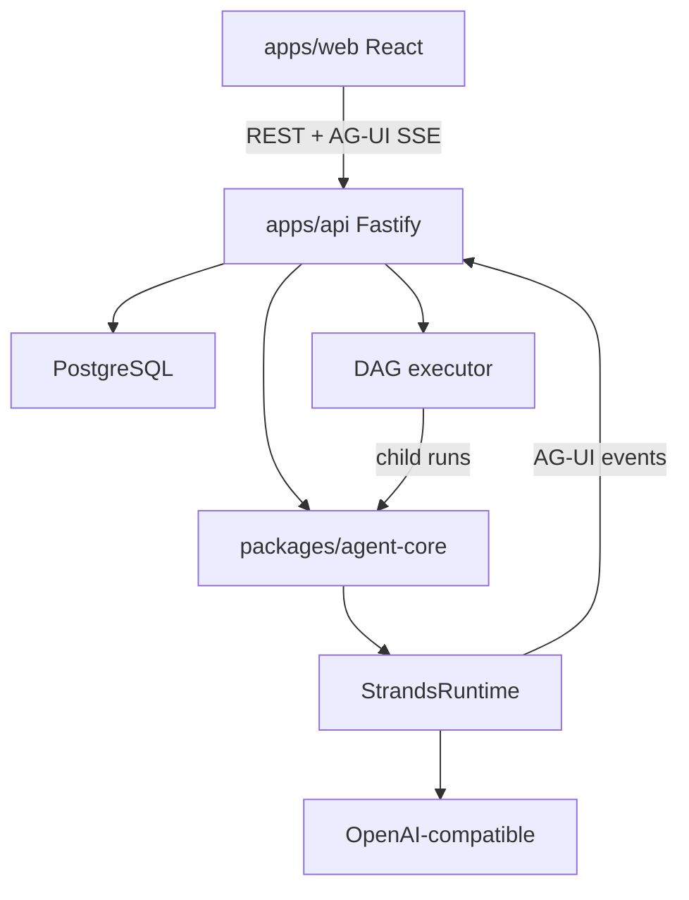

# Architecture overview

jaha-eye is an **operator console for many agents**. An agent is a saved definition; a run is one execution. An **orchestration** is a saved DAG of agents; running it creates a parent run with child runs wired by `parentRunId`.

## Phase 1 (current)

- **In-process execution:** API starts runs and executes Strands in the same Node process.
- **Orchestrations:** in-API DAG executor wraps the existing runner; each graph node is a real child `AgentRun`. We do **not** use Strands Graph/Swarm as the control plane.
- **No Redis, worker, or queue** in Phase 1.
- **Events:** persisted to Postgres, then streamed via SSE.

## Control plane vs data plane

| Control plane | Data plane (Phase 1) |
|---------------|----------------------|
| React UI | Strands SDK |
| Fastify API | Model providers |
| PostgreSQL | Built-in tools |
| Agent + orchestration definitions | In-process inside API |
| DAG executor | Child runs via StrandsRuntime |

**Later:** data plane moves to separate workers behind BullMQ/Redis.

## Key boundaries

1. API never calls `new Agent()` — only `AgentFactory` / `StrandsRuntime`.
2. UI never imports Strands — REST + AG-UI SSE only.
3. Every streamed event is written to `AgentRunEvent` before SSE send.
4. Orchestration parent lifecycle events and child agent events both follow the persist-then-stream rule.

See [control-plane.md](control-plane.md), [events.md](events.md), and [planning/foundations.md](../planning/foundations.md) for the original design rationale.
