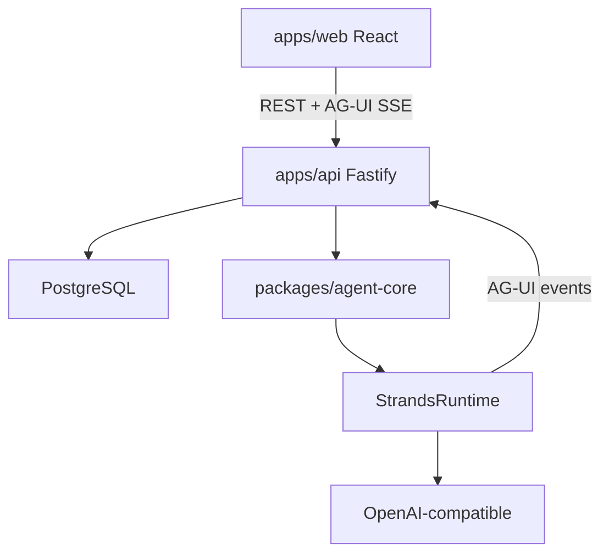

# Architecture overview

jaha-eye is an **operator console for many agents**. An agent is a saved definition; a run is one execution.

## Phase 1 (current)

- **In-process execution:** API starts runs and executes Strands in the same Node process.
- **No Redis, worker, or queue** in Phase 1.
- **Events:** persisted to Postgres, then streamed via SSE.

## Control plane vs data plane

| Control plane | Data plane (Phase 1) |
|---------------|----------------------|
| React UI | Strands SDK |
| Fastify API | Model providers |
| PostgreSQL | Built-in tools |
| Agent definitions | In-process inside API |

**Later:** data plane moves to separate workers behind BullMQ/Redis.

## Key boundaries

1. API never calls `new Agent()` — only `AgentFactory` / `StrandsRuntime`.
2. UI never imports Strands — REST + AG-UI SSE only.
3. Every streamed event is written to `AgentRunEvent` before SSE send.

See [control-plane.md](control-plane.md) and [events.md](events.md).
